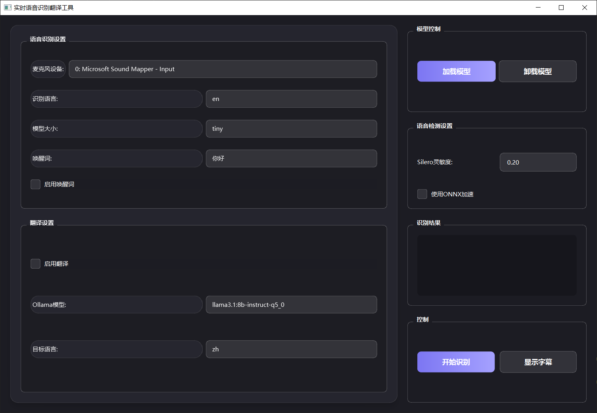

# Real-time Barrage Translator

A real-time speech-to-text and translation application with a modern, translucent UI built using PyQt6. This application captures audio input and provides real-time transcription with translation capabilities.

## Features

- Real-time speech-to-text transcription
- Modern, translucent UI with customizable appearance
- Always-on-top subtitle window
- Adjustable font size, border color, and width
- Drag and resize functionality
- Settings panel for UI customization
- Real-time translation using Ollama

## Requirements

- Python 3.10 or higher
- PyQt6
- PyAudio
- RealtimeSTT
- Ollama
- VoiceMeeter(recognize the computer loudspeaker)

## Installation

1. Clone this repository
2. Install the required packages:
```bash
pip install -r requirements.txt
```

## Usage

1. Run the application:
```bash
python STTgui.py
```

2. The application will display a floating subtitle window that stays on top of other windows
3. Use the settings button (⚙) to customize the appearance:
   - Adjust font size
   - Change border color
   - Modify border width
4. Click and drag the window to reposition it
5. Use the bottom-right corner to resize the window
6. 

## Configuration

The application includes various customization options accessible through the settings panel:
- Font size (12-48px)
- Border color (customizable through color picker)
- Border width (0-10px)

## License

MIT License
